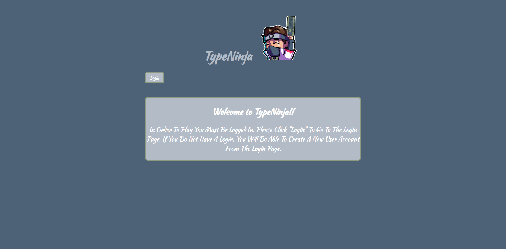
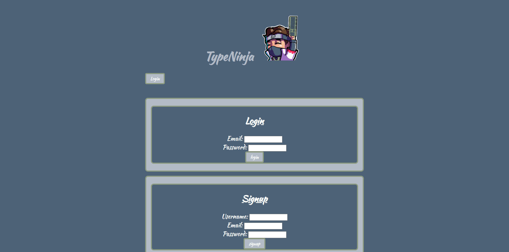
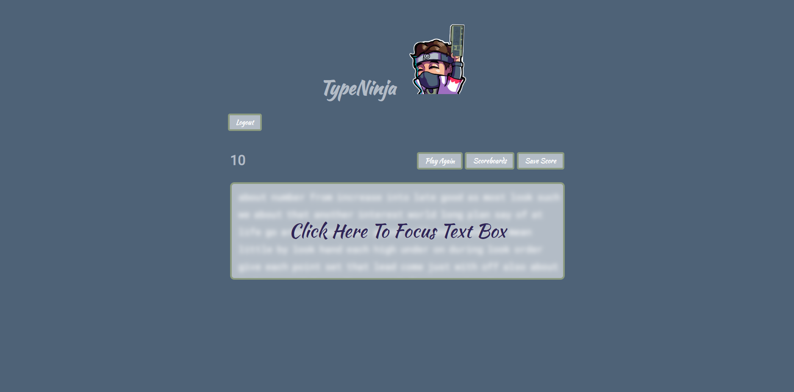
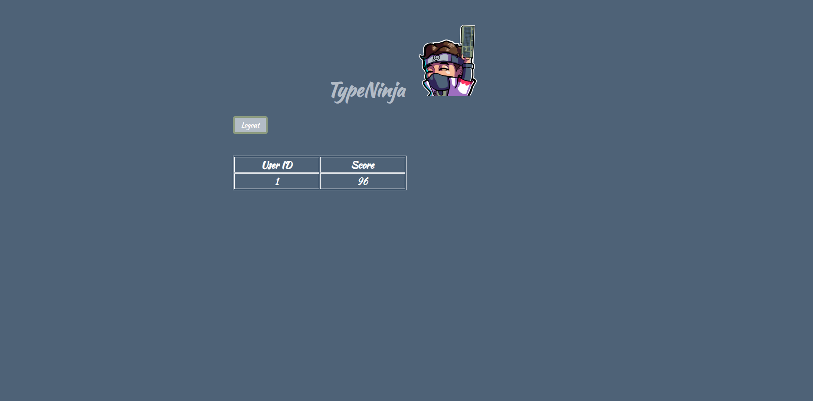

# TypeNinja

## Group Project 2:
```md
A game where developers can practice their typing accuracy and speed with words that are all generated at random.
```

## Table of Contents

 * [Contributors](#contributors)
 * [User Story](#user-story)
 * [Acceptance Criteria](#acceptance-criteria)
 * [Installation](#installation)
 * [Application Demonstration](#application-demonstration)
 * [Live Application](#live-application)
 * [Slideshow Link](#slideshow-link)


## Contributors

- [Brandt C.](https://github.com/MrBrandtCox)
- [Charlie G.](https://github.com/CharlieGarvin)
- [Devon E.](https://github.com/Mersopolis)
- [Greg K.](https://github.com/greg4949)
- [Masyn N.](https://github.com/MasynNay)


## User Story

```md
AS A developer who is constantly typing on a keyboard
I WANT a game that improves my typing speed and accuracy
SO THAT I can write code at a faster pace and not type as many mistakes
```

## Acceptance Criteria

```md
GIVEN a CMS-style blog site
WHEN I visit the site for the first time
THEN I am presented with the homepage, which includes a navigation link with an option to login or sign up.
WHEN I click on the login option
THEN I am prompted to either sign up or sign in
WHEN I choose to sign up
THEN I am prompted to create a username, email and password
WHEN I click on the sign up button
THEN my user credentials are saved and I am logged into the site
WHEN I revisit the site at a later time and choose to sign in
THEN I am prompted to enter my email and password
WHEN I am signed in to the site
THEN I am presented with the game screen to start playing the game
WHEN I click on the scoreboards button 
THEN I am taken to the scoreboards page to inspect the scoreboards
WHEN I play and complete a session of the game
THEN I have an option to save my score ('WPM') to the scoreboards page and saved speeds section
```
## Installation

```md
*Before installation, please ensure you have your .env variables set*
Right click on the type-ninja folder and click "Open in integrated terminal" 
type "npm i" to install dependencies
type "cd .." to return to the previous directory
type "cd db" to enter the db folder
type "mysql -u root -p" then enter your password
type "source schema.sql"
type "exit" to terminate mysql
type "cd .." to return to the previous directory
type "cd seeds" to enter the seeds folder
type "node seed.js" to seed the database
type "cd .." to return to the previous directory
type "npm start" to start the database
```

## Application Demonstration






## Live Application

https://typeninja.herokuapp.com

## Slideshow Link

https://docs.google.com/presentation/d/1bA03eGxy_lMlnNA_essvaDxHzjWdz5wTZraetMrrxFs/edit?usp=sharing